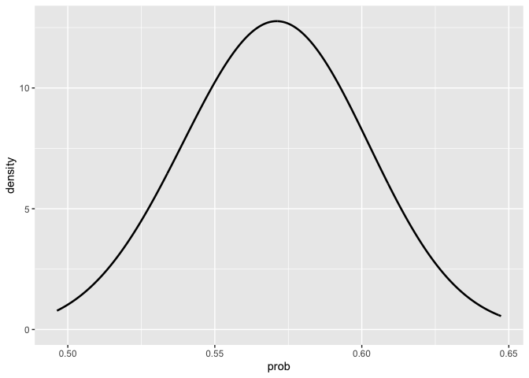

# README.qmd

    Rows: 47243 Columns: 65
    ── Column specification ────────────────────────────────────────────────────────
    Delimiter: ","
    chr (10): match_id, ElapsedTime, PointNumber, P1Score, P2Score, WinnerType, ...
    dbl (38): SetNo, P1GamesWon, P2GamesWon, SetWinner, GameNo, GameWinner, Poin...
    lgl (17): Rally, P1FirstSrvIn, P2FirstSrvIn, P1FirstSrvWon, P2FirstSrvWon, P...

    ℹ Use `spec()` to retrieve the full column specification for this data.
    ℹ Specify the column types or set `show_col_types = FALSE` to quiet this message.

## ATP and WTA Professional Tennis: Calculating In-Match-Win Probability with Bayesian Modeling

This project explores the probabilities of professional tennis players
winning matches. Tennis’ scoring format allows for huge momentum swings
in a short amount of time, and we are going to explore how the
probabilities that tennis players win a match are calculated and update
throughout the match using Bayesian modeling. We will be using the
probability that player1 wins a point on serve against player2, the
probability that player2 wins a point on serve against player1, and the
current score of the match of interest. We will explore the 2022 Men’s
US Open Quarterfinal between Carlos Alcaraz and Jannik Sinner as an
example. Alcaraz defeated Sinner in 5 sets, 6-3, 6-7(7), 6-7(0), 7-5,
6-3.

### Bayesian Modeling

A brief overview on Bayesian modeling is that we start with some
existing beliefs about a parameter, which we call our prior
distribution. We then observe new data come in and update our beliefs
about the parameter based on the new data, which we call our posterior
distribution.

In this project, our parameters of interest are the probabilities that
player1 and player2 win a point on their serve. We calculate these
probabilities using previous matches that have been played. As the match
progresses, we update our beliefs about these probabilities of winning a
point on serve, and at a specific state of the match, we can calculate
the probability that either of the players wins the match.

### Data

The data used in this project is from the ATP and WTA professional
tennis tours, and is from Jeff Sackman’s tennis data on Github. There is
[point-level
data](https://github.com/JeffSackmann/tennis_slam_pointbypoint) on the
ATP and WTA main-draw singles grand slam tournaments from 2011-present.
There is also [match-level
data](https://github.com/JeffSackmann/tennis_atp) for ATP matches and
[match-level data](https://github.com/JeffSackmann/tennis_wta) for WTA
matches. We will be using functions that handle reading in the data and
wrangling it and will not have to interact with the data directly.

### Prior Distributions

We start with some prior beliefs about the probabilities that player1
and player2 win a point on serve. We use the data from previous matches
to calculate these prior distributions. We will update these prior
distributions as the match progresses.

For our example of Alcaraz vs Sinner, we will use data from the leadup
tournaments to the 2022 US Open (hard court tournaments) and the rounds
of the 2022 US Open before the quarterfinals to calculate the
probability that Alcaraz wins a point while serving against Sinner, and
the probability that Sinner wins a point while serving against Alcaraz.
With these estimated probabilities and standard deviations, we then
create distributions for the prior probabilities of winning a point on
serve for Alcaraz and Sinner.

From our prior distributions, we can see that Sinner’s probability of
winning a point on serve against Alcaraz is around 0.57, and Alcaraz’s
probability of winning a point on serve against Sinner is around 0.62.
These are our starting probability distributions for the match. Based on
their prior matches we have included, we think that Alcaraz has a higher
probability of winning a point on his serve than Sinner does, but, there
is some overlap in their prior distributions. As each point is played,
we will update these probability distributions.

### Prior, Data and Posterior

Now with our prior distributions for the probabilities that the players
win a point while serving, we can observe how these probabilities update
throughout the match by looking at a specific state of the match.

For our Alcaraz and Sinner example, now that we have their probabilities
of winning a point on serve, we can look at Sinner when he is serving at
40-15, 1-1 in the 3rd set (a little less than halfway through the match)
and see how his probability of winning a point on serve has changed. At
this state of the match, Sinner has played 150 points on his serve and
won 89 of them, which is right around 0.6.

We can see that Sinner’s probability distribution of winning a point on
serve when he is serving at 40-15, 1-1 in the 3rd set has shifted from
the prior distribution, closer to 0.6.

### Caclulating In-Match-Win Probability

With the probabilities of both players winning a point on their serve,
we can calculate the probability of either player winning the entire
match. We can do this by simulating the match point by point, and
updating the probabilities of the players winning a point on serve as
each successive point is played. For a current state of the match, we
have the updated probabilities of each player winning a point on serve,
and the score at that state of the match, and using these we can
calculate the overall probability of winning the match.

For our example, we will explore the probability that Alcaraz wins the
match.

### Changing Prior Distributions

We can change what matches we include in our prior distributions and see
how this affects our probabilities of each player winning a point on
serve at the start of the match. With these different probabilities of
winning a point on serve, we can see how the overall probability of
winning the match changes.

For our example, we will explore the effect of changing the prior
distributions on the probability of Alcaraz winning the match. We have
our original prior distribution we used, labeled “Small Prior”, and it
included the lead-up tournaments to the 2022 US Open and the 2022 US
Open itself. We will compare this to a “Large Prior” distribution that
includes all hard court matches from the 2021 US Open to the 2022 US
Open itself. We can also fix the probabilities of Sinner and Alcaraz
winning a point on serve at a specific value, such as 0.68 (around tour
average).

    Scale for colour is already present.
    Adding another scale for colour, which will replace the existing scale.

Using different size priors changes the probabilities of Alcaraz and
Sinner winning a point on their serve at the start of the match, and
lead to different probabilities of Alcaraz winning the overall match.
